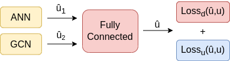

## GCN-FFNN
Implementation code of the paper: "GCN-FFNN: A Two-Stream Deep Model for Learning Solution to Partial Differential Equations" [(ArXiv link)](https://arxiv.org/abs/2106.14742).


## Methodology


## Model Architecture

<br />
<br />



## Usage
Install the required packages with `pip install -r requirements.txt`.

Navigate to the desired folder, e.g. `pde-gcn/1d-burgers/gcn-outer/`.

For training run, e.g.:
```
python gcn-1d-burgers-outer.py
```
For testing run, e.g.:
```
python gcn-1d-burgers-outer.py --test
```


<!-- 
## Citation 
```
```
-->
