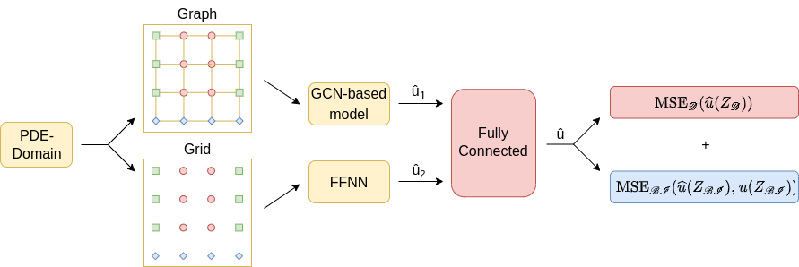
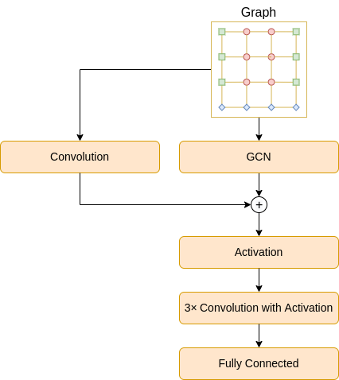
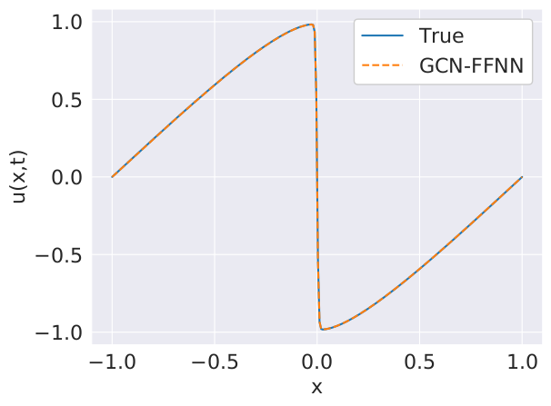
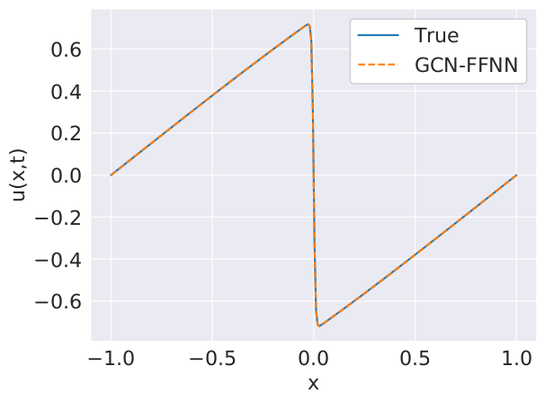
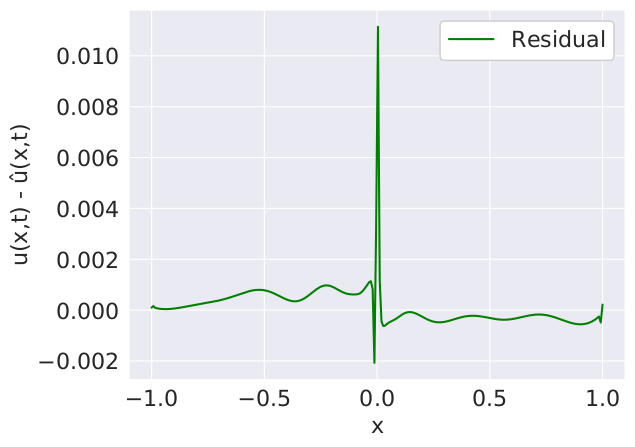
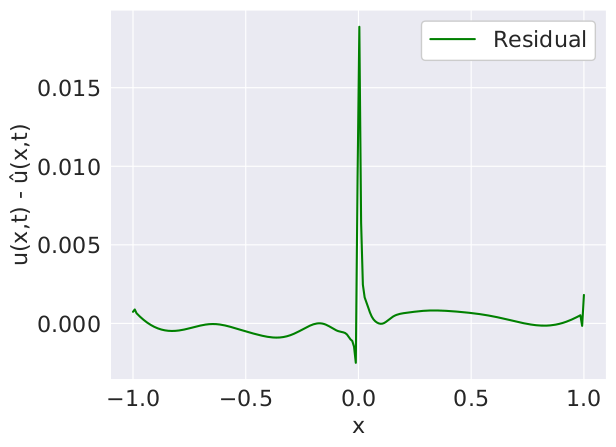
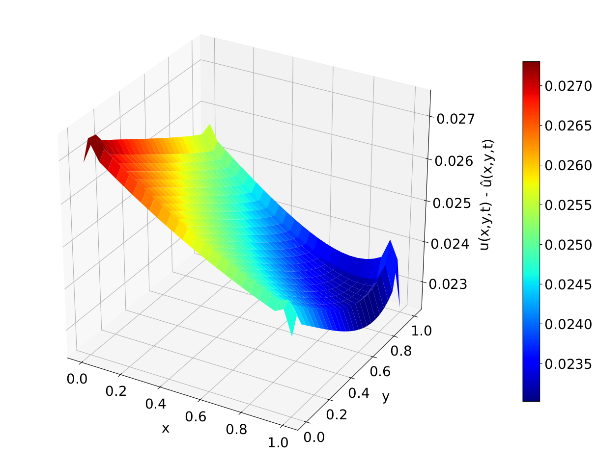

## GCN-FFNN
Official implementation code of the paper: "GCN-FFNN: A Two-Stream Deep Model for Learning Solution to Partial Differential Equations" [(ArXiv link)](https://arxiv.org/abs/2204.13744).


## Methodology

<br />

## GCN Architecture

<br />

## Results
The plots for 1D-Burgers equation for test nodes from outside the domain at t=0.5 and t=0.99:
 
 

The plots for 2D-Burgers equation for test nodes from outside the domain at t=3:
 

## Usage
Install the required packages with `pip install -r requirements.txt`.

Navigate to the desired folder, e.g. `pde-gcn/1d-burgers/ensemble-inner/`.

For training run, e.g.:
```
python ensemble-inner.py
```
For testing run, e.g.:
```
python ensemble-inner.py --test
```


## Citation 
Please cite the paper using the following bibtex reference:
```
@article{BILGIN2022131,
title = {GCN-FFNN: A two-stream deep 
model for learning solution to partial 
differential equations},
journal = {Neurocomputing},
volume = {511},
pages = {131-141},
year = {2022},
issn = {0925-2312},
author = {Onur Bilgin and Thomas Vergutz 
and Siamak Mehrkanoon},
}
```

