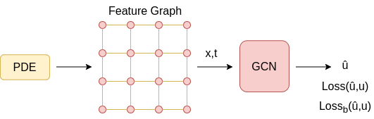

## PDE-GCN
Implementation code of the paper: "Learning solution to partial differential equations using Graph Convolution Network" [(ArXiv link)](https://arxiv.org/abs/2106.14742).





## Usage
Install the required packages with `pip install -r requirements.txt`.

Navigate to the desired folder, e.g. `pde-gcn/1d-burgers/gcn-outer/`.

For training run, e.g.:
```
python gcn-1d-burgers-outer.py
```
For testing run, e.g.:
```
python gcn-1d-burgers-outer.py --test
```


<!-- 
## Citation 
```
```
-->